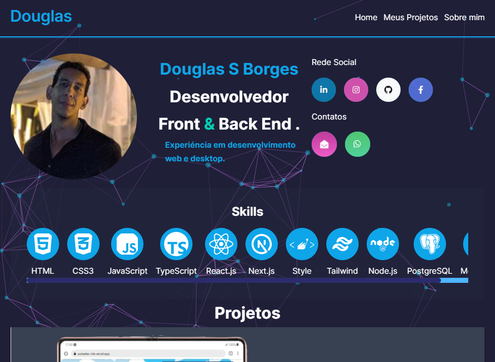

# Projeto

Portfólio desenvolvido para apresentar minhas aplicações e demonstrar as habilidades que possuo em desenvolvimento, incluindo as diversas linguagens que já estudei.

## Tecnologias:

React.js, Next.js, Typescript, Tailwind, Shadcn ui, API RESTful, Node.js, Figma, Deploy.

### Click aqui para Abrir 👉 [Portifolio](https://doug-portifolio.vercel.app/) e saber mais 😁.

## Deploy on Vercel

The easiest way to deploy your Next.js app is to use the [Vercel Platform](https://vercel.com/new?utm_medium=default-template&filter=next.js&utm_source=create-next-app&utm_campaign=create-next-app-readme) from the creators of Next.js.

Check out our [Next.js deployment documentation](https://nextjs.org/docs/deployment) for more details.
